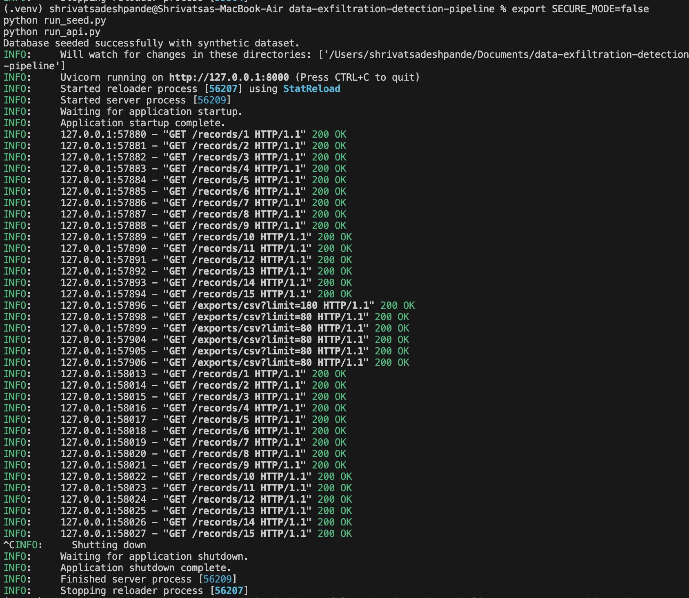
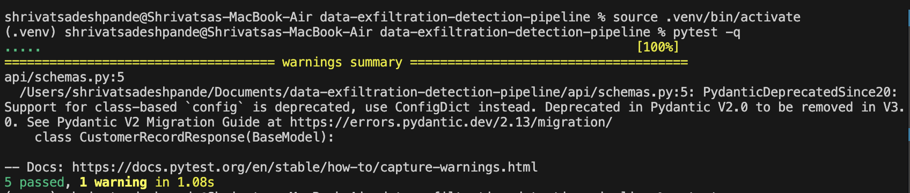
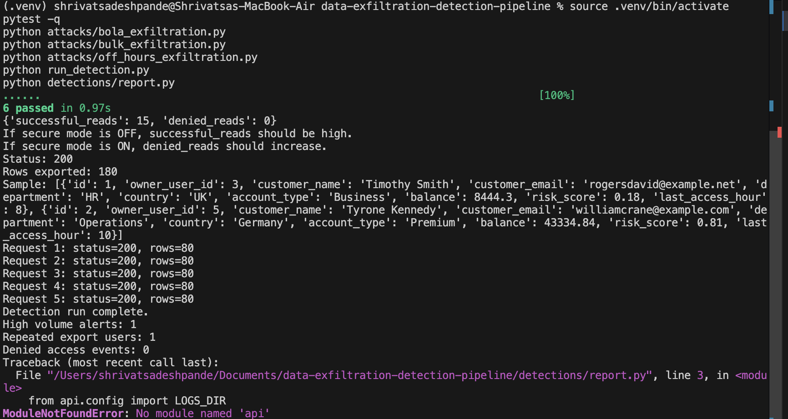
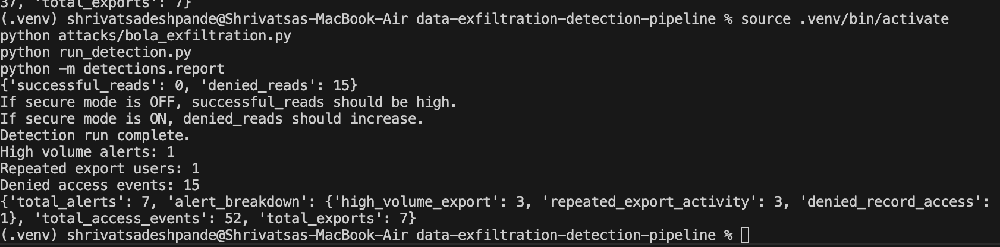

# Data Exfiltration Detection Pipeline

A collaborative cybersecurity lab project that simulates API-based data exfiltration and Broken Object Level Authorization (BOLA) in a controlled local environment. The project demonstrates vulnerable and secure API behavior, logs suspicious activity, and applies rule-based detection to identify exfiltration-style patterns.

## Overview

This project combines synthetic data generation, a FastAPI application, attack simulation scripts, CSV logging, and a lightweight detection engine. It is designed to show how weak object-level authorization can lead to unauthorized access, and how ownership checks plus monitoring can reduce risk.

## Architecture

```text
Synthetic Data Generation
        |
        v
SQLite Database Seeded with Customer Records
        |
        v
FastAPI Application
        |
        +-----------------------------+
        |                             |
        v                             v
Normal API Usage              Attack Simulation Scripts
        |                             |
        +-------------+---------------+
                      |
                      v
              CSV Logs and Alerts
                      |
                      v
          Detection Engine and Reports
                      |
                      v
            Screenshots, Findings, Dashboard
```

### Core Flow

1. `pipeline/` generates synthetic customer data and seeds the database.
2. `api/` exposes record and export endpoints through FastAPI.
3. `attacks/` simulates suspicious or unauthorized access patterns in a controlled lab.
4. `logs/` stores access, export, and alert events in CSV form.
5. `detections/` reads the logs and generates alerts and reports.
6. `docs/` stores architecture notes, threat model, mitigations, findings, and screenshots.
7. `dashboard/` is the analytics layer used to visualize security activity and compare vulnerable versus secure behavior.

### Security Modes

- **Vulnerable mode** demonstrates Broken Object Level Authorization.
- **Secure mode** enforces ownership-based access control and logs denied requests.

### Why this architecture matters

This structure shows the full lifecycle of a security issue: data creation, exposure, attack simulation, detection, mitigation, and evidence presentation. It is intentionally simple so that the cybersecurity story is easy to follow and easy to reproduce.

## Objectives

- Simulate realistic API-driven data exfiltration in a safe local lab.
- Demonstrate a Broken Object Level Authorization weakness.
- Show how ownership checks mitigate unauthorized access.
- Detect suspicious export and access patterns using simple analytics.
- Present a portfolio-ready cybersecurity project on GitHub.

## Tech Stack

- FastAPI
- Uvicorn
- SQLite
- SQLAlchemy
- pandas
- Faker
- pytest
- requests

## Repository Structure

```text
.
├── README.md
├── SECURITY.md
├── api/
├── attacks/
├── dashboard/
├── data/
├── detections/
├── docs/
│   ├── architecture.md
│   ├── findings.md
│   ├── mitigations.md
│   ├── threat_model.md
│   └── screenshots/
├── logs/
├── pipeline/
├── requirements.txt
├── run_api.py
├── run_detection.py
├── run_seed.py
├── tests/
└── utils/
```

## Dataset

This project does not use real personal data. It generates a synthetic dataset using Faker and stores it in CSV/SQLite for testing and demonstration.

Generated fields include:

- `owner_user_id`
- `customer_name`
- `customer_email`
- `department`
- `country`
- `account_type`
- `balance`
- `risk_score`
- `last_access_hour`

## Threats Demonstrated

### 1. Broken Object Level Authorization (BOLA)

In vulnerable mode, the API allows record access by ID without verifying whether the requester owns that object. OWASP describes BOLA as a major API risk because attackers can manipulate object identifiers to access data they should not be able to see. [web:122][web:254]

### 2. Suspicious Data Exfiltration

The project simulates suspicious export behavior through:

- high-volume exports,
- repeated exports,
- and unauthorized record access attempts.

These activities are logged and analyzed by the detection engine.

## Features

- Synthetic dataset generation
- SQLite-backed API
- Record viewing and export endpoints
- Attack simulation scripts
- CSV logging for access and export events
- Detection rules for:
  - high-volume export,
  - repeated export activity,
  - denied record access attempts
- Secure mode toggle for mitigation testing
- Unit tests with pytest
- Screenshot-based evidence of vulnerable and secure behavior

## Vulnerable vs Secure Mode

### Vulnerable mode

```bash
export SECURE_MODE=false
```

Behavior:
- Record ID enumeration succeeds
- Unauthorized reads are possible
- BOLA attack works

### Secure mode

```bash
export SECURE_MODE=true
```

Behavior:
- Ownership checks are enforced
- Unauthorized object access is denied
- Denied access attempts are logged and detected

## Setup

### 1. Clone the repository

```bash
git clone https://github.com/ShrivatsaDeshpande/data-exfiltration-detection-pipeline.git
cd data-exfiltration-detection-pipeline
```

### 2. Create and activate a virtual environment

```bash
python3 -m venv .venv
source .venv/bin/activate
```

### 3. Install dependencies

```bash
python -m pip install --upgrade pip
python -m pip install -r requirements.txt
```

## Running the Project

### Seed the database

```bash
python run_seed.py
```

### Start the API

```bash
python run_api.py
```

### Open in browser

- `http://127.0.0.1:8000/`
- `http://127.0.0.1:8000/health`
- `http://127.0.0.1:8000/docs`

## Running Tests

```bash
pytest -q
```

## Attack Simulations

### BOLA attack

```bash
python attacks/bola_exfiltration.py
```

### Bulk export simulation

```bash
python attacks/bulk_exfiltration.py
```

### Repeated export simulation

```bash
python attacks/off_hours_exfiltration.py
```

## Detection

Run the detection engine:

```bash
python run_detection.py
```

Generate a summary report:

```bash
python -m detections.report
```

## Analytics and Detection

The project collects API access and export events into CSV logs and applies rule-based analytics to identify suspicious behavior.

Current detection rules:

- **High-volume export rule** — flags unusually large export operations.
- **Repeated export rule** — flags repeated exports by the same user.
- **Denied access rule** — flags blocked object access attempts in secure mode.

Example observed outcomes from the project:

- Vulnerable mode allowed unauthorized reads.
- Secure mode blocked the same unauthorized reads.
- Bulk export and repeated export simulations triggered alerts.

This makes the project not just an API demo, but a small cybersecurity analytics pipeline.

## Evidence

### FastAPI API documentation



### Vulnerable mode result



### Secure mode result



### Detection report



## Example Results

### Vulnerable mode

- `successful_reads: 15`
- `denied_reads: 0`

### Secure mode

- `successful_reads: 0`
- `denied_reads: 15`

These outputs demonstrate the difference between insecure object access and enforced ownership-based authorization.

## Collaboration

This was a collaborative project. The work was planned jointly, while implementation responsibilities were divided across team members.

### My Contributions
- Implemented the FastAPI backend and API routes
- Added synthetic data generation and database seeding
- Built attack simulation scripts for BOLA and export-based exfiltration
- Added rule-based detection logic and reporting
- Wrote tests and debugged environment/setup issues
- Prepared the technical documentation and project integration

### Teammate Contributions
- Documentation refinement and project presentation support
- Architecture/threat explanation support
- Result presentation, screenshots, and project communication support

## Security Concepts Demonstrated

- Broken Object Level Authorization (BOLA)
- Object ownership enforcement
- Data exfiltration simulation
- Rule-based anomaly detection
- Secure API design improvements
- Synthetic data usage for safe testing

## Limitations

This is a local educational lab and not a production-grade security platform. Current limitations include:

- simple CSV-based logging,
- simulated identity through headers,
- no real-time SIEM integration,
- no alert deduplication,
- and no production deployment workflow.

## Future Improvements

- JWT-based authentication
- Role-based access control
- Alert deduplication
- Dashboard for visual analytics
- Dockerized deployment
- SIEM-style integration
- Advanced anomaly detection

## Ethical Use

This repository is intended for educational and defensive security research in a controlled local environment only. Do not use these techniques against systems, APIs, or datasets you do not own or have explicit permission to test.

## License

Add a license before publishing, for example:

- MIT License

## Author

Shrivatsa Deshpande  
GitHub: `https://github.com/ShrivatsaDeshpande`
Xiaoxu Jing 
GitHub: `https://github.com/xiaoxujing1227`